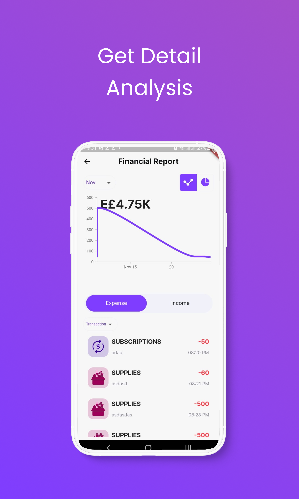

# Expense Tracker

 App to help user Track expenses and incomes and get monthly reports.

  
  
   
     
       
         
           
             
               
                 
                   
                     

## Features

- Add and track money transactions expenses and incomes.
- Add budget for each category.
- Support automatic frequently transactions with notifications.
- Support multiple accounts with two types bank account/ wallet.
- Transfer balance between accounts.
- Monthly report with highest and lowest category spent.

## Tools & Packages

### [Auto Route](https://pub.dev/packages/auto_route)

### [Syncfusion Flutter Charts](https://pub.dev/packages/syncfusion_flutter_charts)

### [Flutter Local Notifications](https://pub.dev/packages/flutter_local_notifications)

### [Shared Preferences](https://pub.dev/packages/shared_preferences)

### [Get It](https://pub.dev/packages/get_it)

### [Firebase Auth](https://pub.dev/packages/firebase_auth)

### [Cloud Firestore](https://pub.dev/packages/cloud_firestore)

### [Firebase Messaging](https://pub.dev/packages/firebase_messaging)

### [Cloud Functions](https://pub.dev/packages/cloud_functions)

## UI kit

 [UI kit source page](https://www.figma.com/community/file/998557875473123405)

